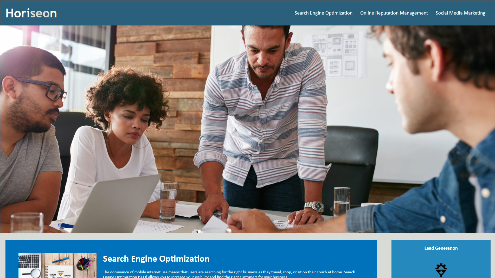

# Refactoring Horiseon's Webpage - Project Challenge
## Description
The goal for this project was to take an existing site and refactor its code in order to make it more **accessible**, while also maintaining it's appearance and functionality. Web accessibility is important for businesses because it ensures people with disabilities can access a website using assistive technology. It also improves a websites SEO.

Keeping this in mind, I applied a variety of HTML semantics in replacement of several div's, removed any un-used code, and optimized the CSS by removing any repeated properties. I also added helpful CSS comments in good practice.

### You can view my project [here](https://adairconlin.art/horiseon/)

```md

```
